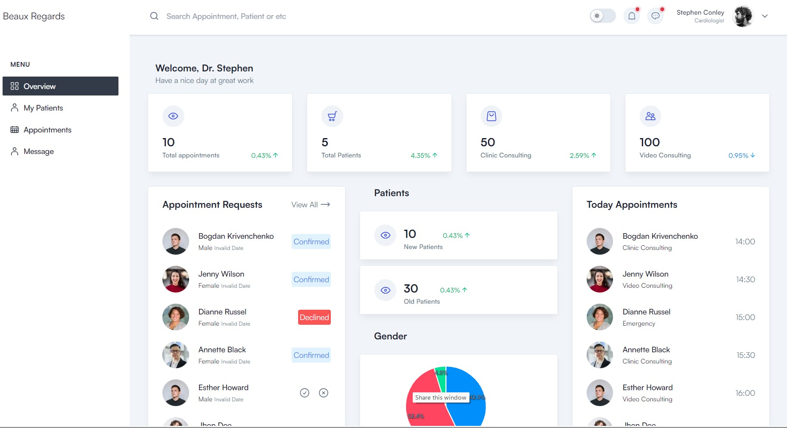
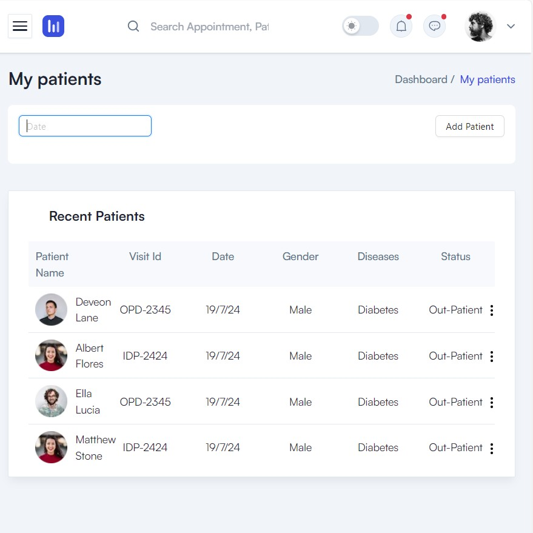
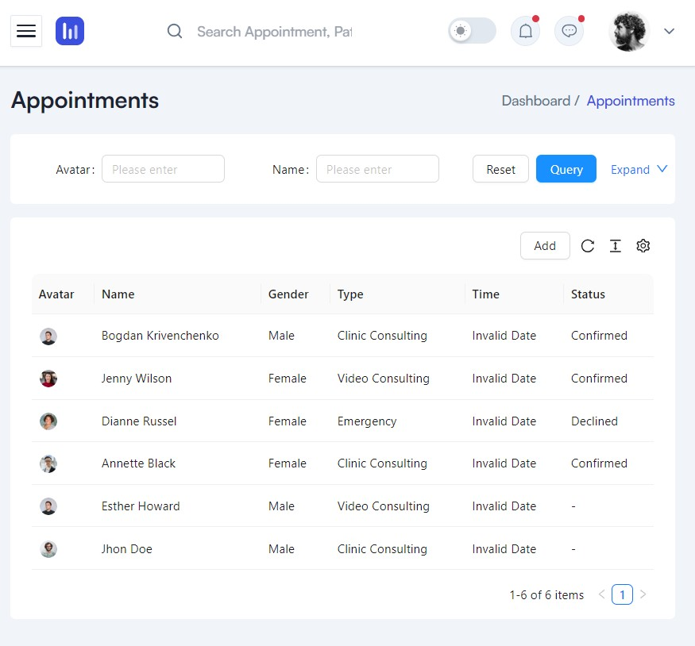
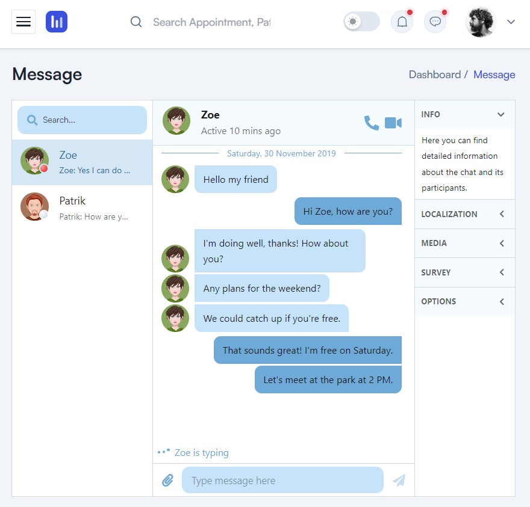

# Chronic Disease Management System 
This project was developed as a university project with the goal of providing secure communication between patients and doctors.

### Background and Requirements
#### 👉 Key Features
- Address Inefficiencies in Chronic Disease Management: Streamline the management of chronic diseases by providing tools to improve tracking and treatment.
- Improve Patient Monitoring: Enhance the monitoring of patients through real-time updates and alerts.
- Unify Medical Records: Consolidate medical records into a single, accessible platform.
- Enhance Communication: Facilitate better communication between patients and healthcare providers through encrypted messaging and video conferencing.

  
   
   
   

___

### Implementation

## Implementation
### Technology
#### 👉  Web Frontend
* Framework: NestJs
* UI Components: Ant Design (Antd)
* Backend: Java Spring Boot
* Real-Time Communication: WebSocket

#### 👉  Backend
* Spring Boot 3.3
* Java 21 (OpenJDK)
* Real-Time Communication: WebSocket

#### 👉  Database
* Database Management Systems: MySQL, H2 Database

#### 👉  Cloud
* Firebase

### 👉  Basic structure
* frontend = Folder for web project
* backend = Folder for spring boot backend
